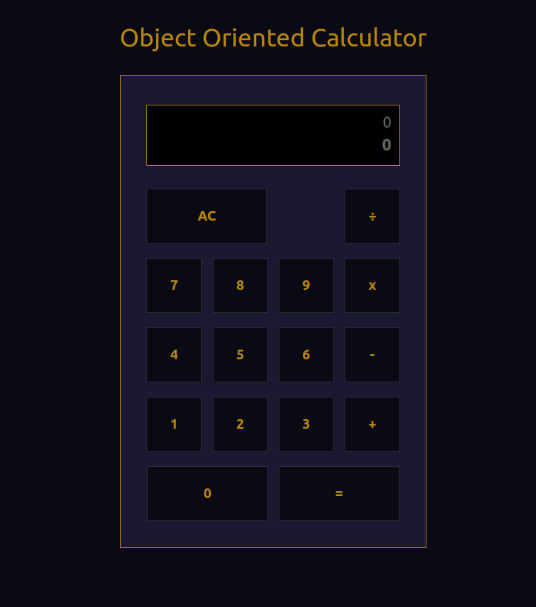

# Object Oriented Calculator 📱

* <a href="https://anic4cio.github.io/calculator-poo/only_css_version/" target="_blank" rel="noopener noreferrer">Click here to access the calculator by GitHub Pages</a>
 
## _**My first calculator that was created with Javascript, HTML and CSS.**_ 🇧🇷

It was hard and I did have some troubles with Javascript and even harder with CSS, but at least everything worked out!

### _*Update 12/2022*_ 🚩
In december 2022, I've started a node project, add Typescript and code style with Eslint to project.
And set it to be deployed with Github Action at merge in master branch.

### And here it is! 👇🏽

